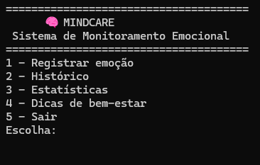
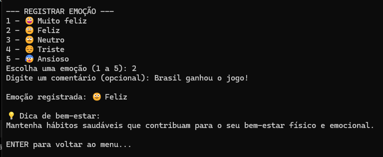
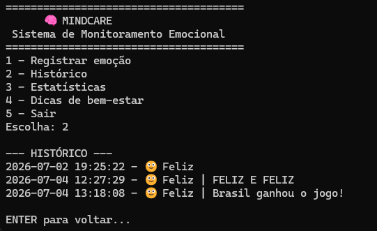
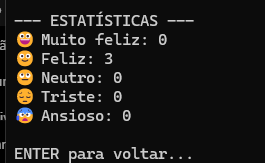
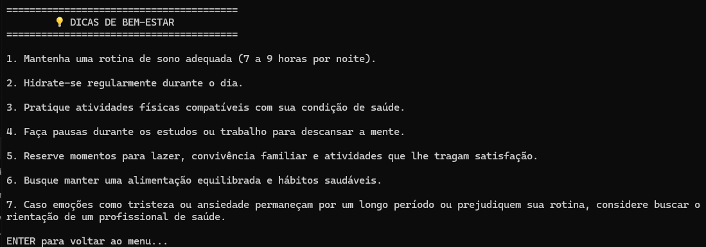

# 🧠 MindCare

## Sistema para promoção da saúde mental e inclusão digital

O **MindCare** é um sistema desenvolvido em Python como atividade extensionista da UNINTER, voltado à promoção da saúde mental e da inclusão digital.

Seu objetivo é oferecer uma ferramenta simples e acessível para que os usuários possam registrar suas emoções, acompanhar seu histórico emocional e receber orientações básicas relacionadas ao bem-estar.

---

# Objetivos

- Promover a conscientização sobre a importância da saúde mental;
- Incentivar o autoconhecimento por meio do registro das emoções;
- Disponibilizar orientações de bem-estar de forma simples e acessível;
- Demonstrar a aplicação prática da linguagem Python no desenvolvimento de soluções voltadas à comunidade.

---

# Funcionalidades

✅ Registro de emoções

✅ Comentários opcionais

✅ Histórico com data e hora

✅ Estatísticas das emoções registradas

✅ Dicas personalizadas conforme a emoção escolhida

✅ Tela com orientações gerais de bem-estar

---

# Tecnologias utilizadas

- Python 3.12
- Manipulação de arquivos (.txt)
- Biblioteca datetime
- Biblioteca os

---

# Público-alvo

Comunidade de Iguabinha-RJ, especialmente pessoas que desejam registrar seu estado emocional de maneira simples e incentivar hábitos relacionados ao bem-estar.

---

# Objetivos de Desenvolvimento Sustentável (ODS)

O projeto está alinhado ao:

**ODS 3 — Saúde e Bem-Estar**

Promovendo ações voltadas ao acompanhamento das emoções e incentivo ao autocuidado.

---
---

# 📷 Demonstração do Sistema

## Menu Principal

---

## Registro de Emoção

---

## Histórico de Registros

---

## Estatísticas

---

## Dicas de Bem-Estar

# Autor

Larissa Caroline Rangel Silva
UNINTER
Curso de Análise e Desenvolvimento de Sistemas

UNINTER
